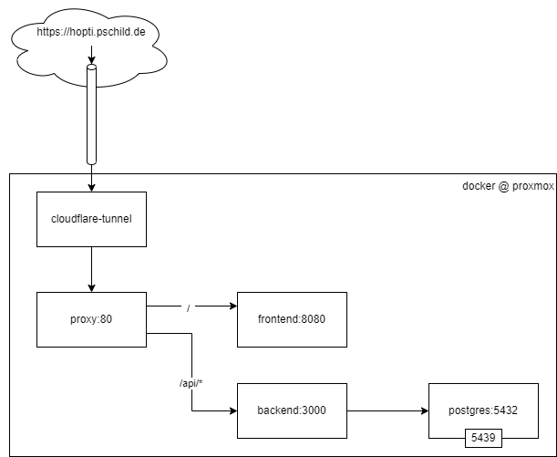

## Architecture



## Commands

### Export dump

Run the following script to export a db dump from a running docker container:
```bash
./db/export.sh
```

### Import dump

Please note: The database needs to be cleared before importing the dump!  
You can do that manually via IntelliJ:  
Mark all tables > right click > SQL Scripts > Truncate... > Check _Use CASCADE_ > OK

Then, run the following command to import a db dump:
```bash
docker compose up db-restore-dump
```
